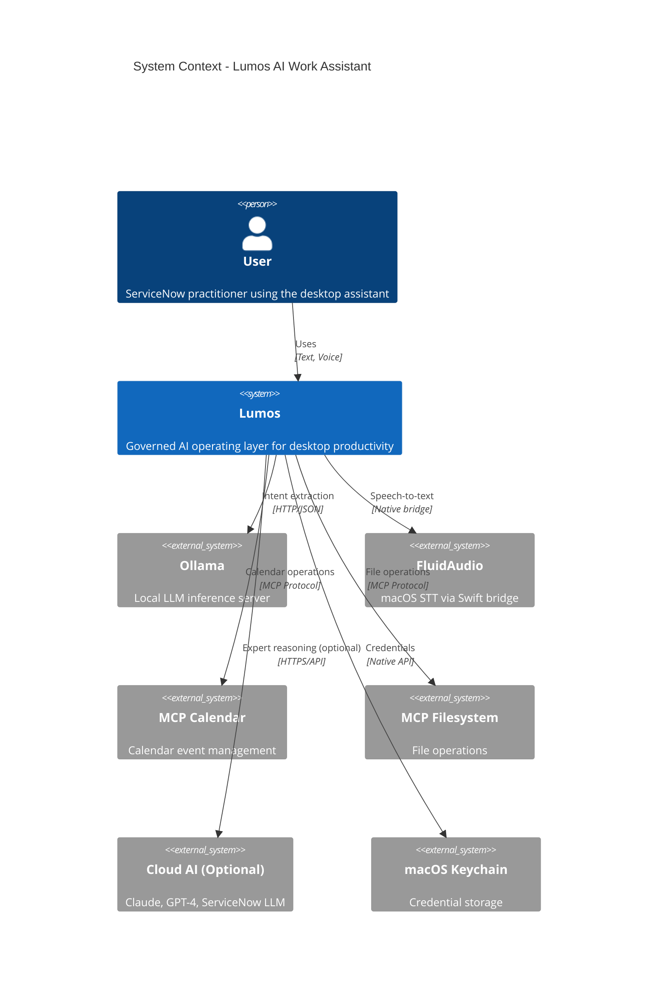
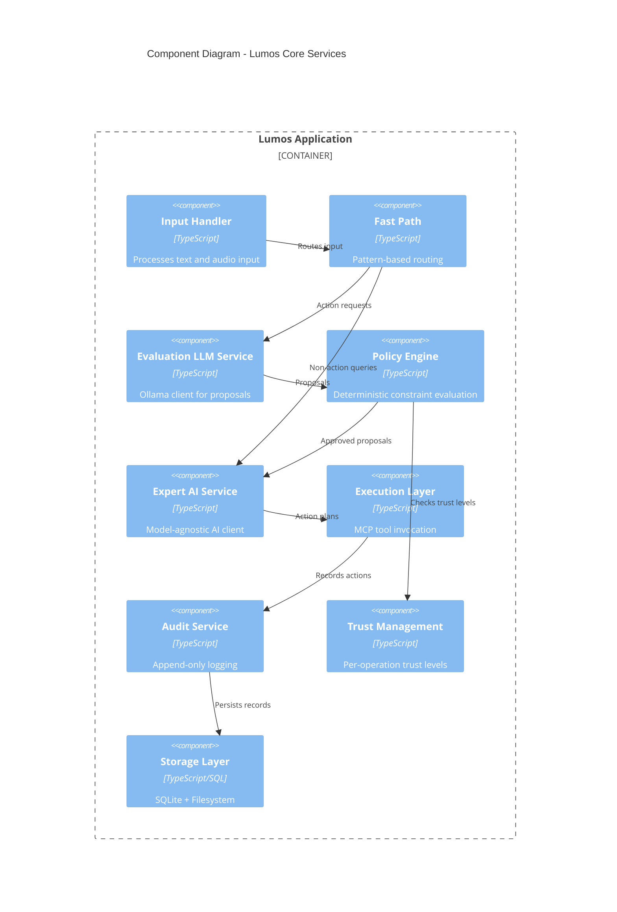
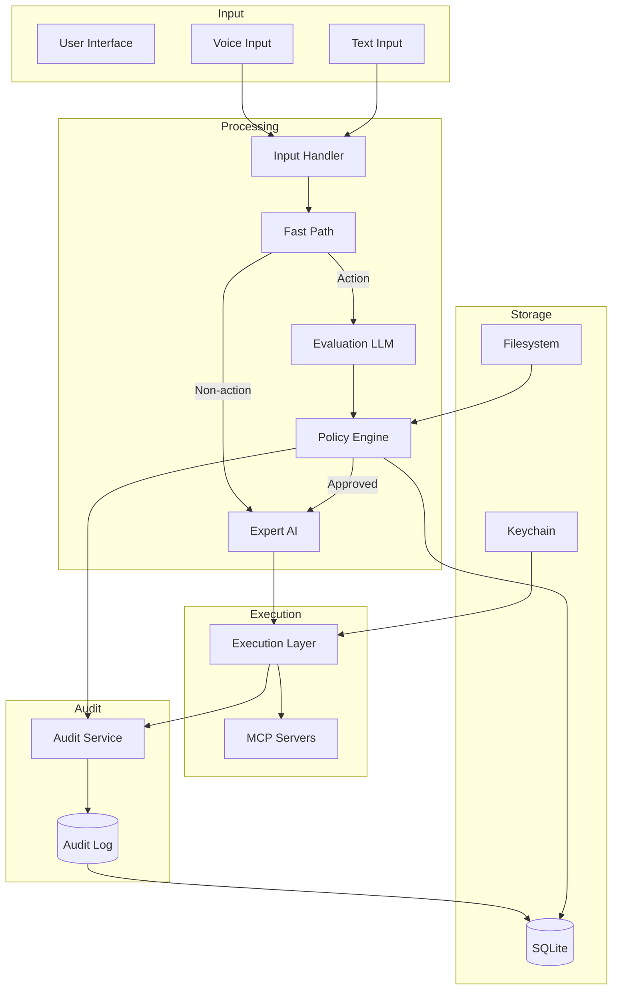
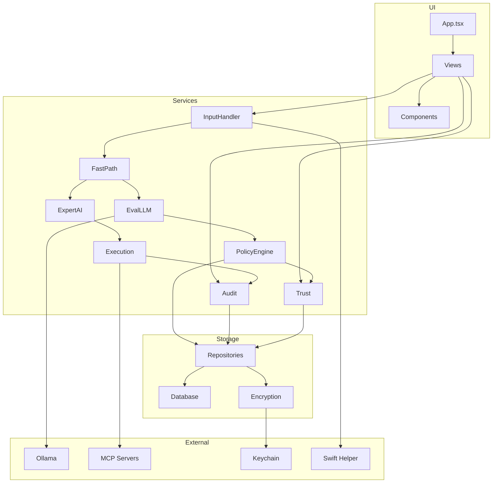

# Engineering Blueprint v1.0

**Project:** Lumos - AI Work Assistant
**Version:** 1.0
**Date:** 2026-01-28
**Architect:** Software Architect (CodeMaestro v1.1.0)
**CodeMaestro:** v1.1.0

---

## Meta

| Field      | Value                                                      |
| ---------- | ---------------------------------------------------------- |
| Domain     | Desktop / AI/ML                                            |
| Pattern    | Event-Driven Layered Architecture with Governance Pipeline |
| Scale      | Medium                                                     |
| Team Size  | 1-2 developers                                             |
| Skill Tier | Advanced                                                   |

---

## 1. Architecture Overview

### 1.1 System Purpose

Lumos is a **governed AI operating layer** for desktop productivity that:

- Processes user requests via text and voice input
- Generates structured action proposals using local AI
- Enforces governance through deterministic policy evaluation
- Executes approved actions via MCP tools
- Maintains complete audit trails with rollback capability

### 1.2 Core Design Principles

| Principle                       | Implementation                                 |
| ------------------------------- | ---------------------------------------------- |
| **AI proposes, humans approve** | Dual-LLM architecture with policy gate         |
| **Observable**                  | Append-only audit logs, visible permissions    |
| **Reversible**                  | Rollback plans for all reversible operations   |
| **Controllable**                | Per-operation trust levels, instant revocation |
| **Local-first**                 | Evaluation LLM runs locally, no cloud fallback |
| **Fail-safe**                   | Policy engine crash = deny action              |

### 1.3 Architecture Pattern

**Pattern:** Event-Driven Layered Architecture with Governance Pipeline

```
┌─────────────────────────────────────────────────────────────────────┐
│                        PRESENTATION LAYER                           │
│  ┌──────────────────────────────────────────────────────────────┐  │
│  │  Electron Main Process  ←→  Renderer Process (React)         │  │
│  │  - Window management        - Chat View                      │  │
│  │  - Native integrations      - Activity View                  │  │
│  │  - IPC bridge               - Permissions View               │  │
│  │                             - Skills View                    │  │
│  │                             - Settings View                  │  │
│  └──────────────────────────────────────────────────────────────┘  │
├─────────────────────────────────────────────────────────────────────┤
│                        GOVERNANCE PIPELINE                          │
│  ┌─────────┐   ┌─────────┐   ┌─────────┐   ┌─────────┐            │
│  │  Input  │──▶│  Fast   │──▶│  Eval   │──▶│ Policy  │──▶ Confirm │
│  │ Handler │   │  Path   │   │   LLM   │   │ Engine  │            │
│  └─────────┘   └─────────┘   └─────────┘   └─────────┘            │
│       ▲              │                                              │
│       │              ▼ (non-action)                                 │
│       │         ┌─────────┐                                        │
│       │         │ Expert  │                                        │
│       │         │   AI    │                                        │
│       │         └─────────┘                                        │
├─────────────────────────────────────────────────────────────────────┤
│                        EXECUTION LAYER                              │
│  ┌──────────────────────────────────────────────────────────────┐  │
│  │  Execution Layer  ←→  MCP Tool Registry  ←→  MCP Servers     │  │
│  └──────────────────────────────────────────────────────────────┘  │
├─────────────────────────────────────────────────────────────────────┤
│                        DATA LAYER                                   │
│  ┌─────────────┐  ┌─────────────┐  ┌─────────────┐                │
│  │   SQLite    │  │ Filesystem  │  │  Keychain   │                │
│  │  runtime.db │  │   (YAML)    │  │ (Electron   │                │
│  │             │  │             │  │ safeStorage)│                │
│  └─────────────┘  └─────────────┘  └─────────────┘                │
├─────────────────────────────────────────────────────────────────────┤
│                        CROSS-CUTTING                                │
│  ┌─────────────┐  ┌─────────────┐  ┌─────────────┐                │
│  │   Audit     │  │    Trust    │  │    Error    │                │
│  │  Service    │  │ Management  │  │  Handler    │                │
│  └─────────────┘  └─────────────┘  └─────────────┘                │
└─────────────────────────────────────────────────────────────────────┘
```

---

## 2. Domain Adaptations

**Detected Domain:** Desktop / AI/ML

**Domain-Specific Patterns Applied:**

### For Desktop:

- [x] Native OS integration (macOS first)
- [x] Local-first architecture with SQLite
- [x] System-level permissions (Keychain, microphone)
- [x] Application bundle distribution

### For AI/ML:

- [x] Dual-LLM architecture (local + cloud)
- [x] Model serving infrastructure (Ollama integration)
- [x] Training vs inference separation (local eval, cloud expert)
- [x] Constrained output generation (JSON schema validation)

**Domain-Specific Considerations:**

- Desktop app requires code signing and notarization for macOS
- AI governance requires deterministic policy engine (no LLM in critical path)
- Local LLM performance depends on hardware (recommend 16GB+ RAM)
- Cross-platform expansion (Windows) deferred to Phase 2

---

## 3. System Context Diagram



---

## 4. Component Diagram



---

## 5. Component Descriptions

### 5.1 Input Handler Service

**Responsibility:** Process text and audio input from user.

**Interfaces:**

```typescript
interface InputHandlerService {
  submitText(text: string): Promise<ProcessedInput>;
  startRecording(): Promise<void>;
  stopRecording(): Promise<TranscriptionPreview>;
  confirmTranscription(preview: TranscriptionPreview): Promise<ProcessedInput>;
  cancelTranscription(): void;
  onTranscriptionUpdate(callback: (partial: string) => void): void;
  onRecordingStateChange(callback: (state: RecordingState) => void): void;
}
```

**Dependencies:**

- FluidAudio (native Swift bridge)
- Event emitter for UI updates

**Design Decisions:**

- Audio processing via native Swift bridge for macOS integration
- Transcription preview allows user to confirm/edit before submission
- Streaming partial transcripts for real-time feedback

### 5.2 Fast Path Service

**Responsibility:** Classify input and route to appropriate processor.

**Interfaces:**

```typescript
interface FastPathService {
  classify(input: ProcessedInput): FastPathResult;
}

interface FastPathResult {
  classification: 'action' | 'non_action';
  confidence: number;
  matched_pattern: string | null;
  route_to: 'evaluation_llm' | 'expert_ai';
}
```

**Dependencies:**

- Pattern matching engine (regex-based)

**Performance Target:** <10ms classification

**Design Decisions:**

- Pure TypeScript pattern matching (no LLM)
- Action patterns take priority over non-action patterns
- Ambiguous input defaults to Evaluation LLM (fail-safe)

### 5.3 Evaluation LLM Service

**Responsibility:** Extract intent and generate structured action proposals.

**Interfaces:**

```typescript
interface EvaluationLLMService {
  initialize(config: EvaluationLLMConfig): Promise<void>;
  generateProposal(input: ProcessedInput): Promise<ActionProposal>;
  isAvailable(): Promise<boolean>;
  getModelInfo(): ModelInfo;
}
```

**Dependencies:**

- Ollama HTTP client
- JSON Schema validator

**Performance Target:** 2-3 seconds generation

**Design Decisions:**

- **Local-only execution** - No cloud fallback (governance requirement)
- **Constrained JSON decoding** - Uses Ollama's `format` parameter
- **Schema validation** - Double-check output against ActionProposal schema
- **Low temperature** (0.1) - Consistent, deterministic outputs

### 5.4 Policy Engine

**Responsibility:** Deterministically evaluate proposals against skills and policies.

**Interfaces:**

```typescript
interface PolicyEngine {
  evaluate(proposal: ActionProposal, context: EvaluationContext): PolicyResult;
  findMatchingSkills(operation: OperationType): Skill[];
  resolveConflicts(skills: Skill[], proposal: ActionProposal): Skill | null;
}
```

**Dependencies:**

- Skill registry
- Trust management service
- JSON Schema validator

**Performance Target:** <50ms evaluation

**Design Decisions:**

- **Pure TypeScript** - No LLM involvement (fail-safe guarantee)
- **Priority-based skill matching** - Higher priority skills evaluated first
- **Fail-safe on crash** - Engine failure = deny action
- **Constraint compilation** - Pre-compile TypeScript constraint expressions

### 5.5 Expert AI Service

**Responsibility:** Complex reasoning, action planning, and response generation.

**Interfaces:**

```typescript
interface ExpertAIService {
  initialize(config: ExpertAIConfig): Promise<void>;
  processQuery(input: ProcessedInput): Promise<ExpertResponse>;
  planAction(proposal: ActionProposal): Promise<ActionPlan>;
  generateRollbackPlan(action: ExecutedAction): Promise<RollbackPlan>;
  switchModel(modelId: string): Promise<void>;
  getAvailableModels(): ModelOption[];
}
```

**Dependencies:**

- Multiple AI provider clients (Ollama, Claude, OpenAI)
- Model configuration registry

**Design Decisions:**

- **User-selectable model** - Local or cloud based on preference
- **Cannot bypass policy engine** - All proposals go through governance
- **Model-agnostic interface** - Unified API across providers
- **Fallback chain** - Local model as fallback if cloud unavailable

### 5.6 Execution Layer

**Responsibility:** Execute approved actions via MCP tools.

**Interfaces:**

```typescript
interface ExecutionLayer {
  execute(plan: ActionPlan, proposal: ActionProposal): Promise<ExecutionResult>;
  rollback(action: ExecutedAction): Promise<RollbackResult>;
  getRegisteredTools(): MCPTool[];
}
```

**Dependencies:**

- MCP client library
- MCP server registry
- Audit service

**Design Decisions:**

- **Fail-safe tool registration** - Unregistered tools cannot be invoked
- **State capture before execution** - Enables rollback
- **Automatic rollback on failure** - Multi-step operations rolled back on error
- **Capability-based security** - Tools restricted to declared capabilities

### 5.7 Audit Service

**Responsibility:** Maintain append-only log of all significant events.

**Interfaces:**

```typescript
interface AuditService {
  log(record: Omit<AuditRecord, 'id' | 'timestamp'>): Promise<AuditRecord>;
  query(filter: AuditFilter): Promise<AuditRecord[]>;
  getById(id: string): Promise<AuditRecord | null>;
  export(filter: AuditFilter, format: 'json' | 'csv'): Promise<string>;
}
```

**Dependencies:**

- SQLite database
- Export formatters

**Design Decisions:**

- **Append-only storage** - No UPDATE/DELETE on audit_log table
- **Immutable records** - Rollbacks create new records with reference
- **Hash-based integrity** - Input hashes for privacy, content hashes for integrity
- **Queryable interface** - Filters for UI and debugging

### 5.8 Trust Management Service

**Responsibility:** Manage trust levels per operation type.

**Interfaces:**

```typescript
interface TrustManagementService {
  getTrustLevel(operation: OperationType): TrustLevel;
  getAllTrustLevels(): Map<OperationType, TrustLevelRecord>;
  promoteTrust(operation: OperationType): Promise<PromotionResult>;
  demoteTrust(operation: OperationType, targetLevel: TrustLevel): Promise<void>;
  recordSuccess(operation: OperationType): Promise<void>;
  recordRollback(operation: OperationType): Promise<void>;
  checkAttestationDue(): AttestationCheck[];
  confirmAttestation(operations: OperationType[]): Promise<void>;
}
```

**Dependencies:**

- SQLite database
- Notification service (for attestation reminders)

**Design Decisions:**

- **Per-operation trust** - Trust earned for specific operations, not globally
- **Progressive delegation** - OBSERVE → SUPERVISED → DELEGATED
- **Automatic demotion on rollback** - Trust lost on failure
- **30-day attestation** - DELEGATED operations require periodic review

---

## 6. Architectural Decisions (ADRs)

### ADR-001: Dual-LLM Architecture

**Status:** Accepted
**Date:** 2026-01-28
**Deciders:** Software Architect

**Context:**
We need AI capabilities for both intent extraction (proposals) and complex reasoning (expert assistance). These have different requirements for speed, accuracy, and governance.

**Decision:**
Implement a dual-LLM architecture:

1. **Evaluation LLM** (local-only, Ollama) - Fast intent extraction with constrained JSON output
2. **Expert AI** (user-selectable) - Complex reasoning, model-agnostic

**Rationale:**

- Evaluation LLM must be local for governance (no external data leakage)
- Expert AI can be user-selected based on task complexity
- Separation allows different optimization strategies
- Constrained JSON decoding ensures consistent proposal format

**Competitive Context:**

- **GitHub Copilot Approach:** Cloud-only models, no local option
- **Continue.dev Approach:** Supports local models but no governance layer
- **Our Differentiator:** Local-first with governance, privacy-focused
- **Strategic Advantage:** GDPR/compliance friendly, works offline

**Consequences:**

- **Positive:**
  - Privacy-first approach appeals to enterprise users
  - Offline capability differentiates from cloud-only solutions
  - Clear governance boundary enables auditability
- **Negative:**
  - Requires Ollama installation (setup friction)
  - Two AI pipelines to maintain
  - **Mitigation:** Provide one-click Ollama installer

---

### ADR-002: Deterministic Policy Engine (No LLM)

**Status:** Accepted
**Date:** 2026-01-28

**Context:**
The policy engine is the security-critical component that determines which actions are allowed. It must be predictable and auditable.

**Decision:**
Implement the policy engine as pure TypeScript with deterministic evaluation. No LLM involvement in policy decisions.

**Rationale:**

- LLM outputs are non-deterministic and could be manipulated
- Governance requires predictable, auditable decisions
- Performance requirement (<50ms) incompatible with LLM latency
- Fail-safe: if engine crashes, default to DENY

**Consequences:**

- Skills must define constraints as TypeScript expressions
- Policy rules are less flexible than natural language
- Easier to audit and test
- Guaranteed consistent behavior

---

### ADR-003: Swift-Electron Bridge via IPC

**Status:** Accepted
**Date:** 2026-01-28

**Context:**
FluidAudio requires native macOS Swift integration. We need to bridge this with Electron's Node.js runtime.

**Decision:**
Use IPC (Inter-Process Communication) with a separate Swift helper process rather than native Node modules.

**Alternatives Considered:**

1. **Native Node module (N-API)** - Complex build, memory management issues
2. **IPC bridge** - Simpler, process isolation ✓
3. **Electron native module** - Limited Swift support

**Rationale:**

- Process isolation provides stability (crash doesn't take down app)
- Simpler development and debugging
- Standard IPC patterns (JSON over stdio/socket)
- Easier to test Swift component independently

**Consequences:**

- Additional latency (~10-20ms for IPC)
- Need to manage Swift process lifecycle
- Audio data serialization overhead
- Better fault isolation

---

### ADR-004: Ollama Constrained JSON Decoding

**Status:** Accepted
**Date:** 2026-01-28

**Context:**
The Evaluation LLM must output valid ActionProposal JSON. Free-form LLM output is unreliable.

**Decision:**
Use Ollama's `format` parameter with JSON Schema for constrained decoding, with JSON Schema validation as fallback.

**Implementation:**

```typescript
const request = {
  model: 'qwen3-vl-4b',
  format: PROPOSAL_JSON_SCHEMA,
  options: { temperature: 0.1 },
};
```

**Rationale:**

- Grammar-based generation guarantees valid JSON structure
- Low temperature reduces variability
- Schema validation catches edge cases
- Recovery strategy: retry with simplified prompt

**Consequences:**

- Requires Ollama with JSON mode support
- Limited to schema-describable outputs
- Must handle parsing failures gracefully

---

### ADR-005: Append-Only Audit Log Design

**Status:** Accepted
**Date:** 2026-01-28

**Context:**
Audit logs are critical for governance and must be tamper-evident.

**Decision:**
Implement audit logs as append-only SQLite table with no UPDATE/DELETE operations. Rollbacks create new records referencing the original.

**Implementation:**

```sql
-- No UPDATE or DELETE permissions on this table
CREATE TABLE audit_log (
  id TEXT PRIMARY KEY,
  timestamp TEXT NOT NULL,
  ...
  rollback_of TEXT REFERENCES audit_log(id)  -- Links to rolled-back action
);
```

**Rationale:**

- Append-only provides tamper evidence
- Record linking enables audit trails
- SQLite triggers can enforce at database level
- Export capability for compliance

**Consequences:**

- Database grows over time (need archival strategy)
- Cannot "fix" incorrect entries (must create corrections)
- Clear audit trail for all actions

---

### ADR-006: MCP for Tool Execution

**Status:** Accepted
**Date:** 2026-01-28

**Context:**
The system needs to interact with external services (calendar, filesystem) through a standardized interface.

**Decision:**
Use Model Context Protocol (MCP) for all tool integrations. Public MCP servers for Phase 1, custom ServiceNow MCP for Phase 2.

**Rationale:**

- Standardized protocol for AI-tool interaction
- Growing ecosystem of public MCP servers
- Consistent capability model and security
- Enables third-party tool integration

**Consequences:**

- Dependent on MCP server availability
- Must implement MCP client
- ServiceNow integration requires custom MCP server development

---

### ADR-007: Progressive Trust Levels

**Status:** Accepted
**Date:** 2026-01-28

**Context:**
Users need to control how much autonomy the AI has for different operations.

**Decision:**
Implement three trust levels per operation type:

- **OBSERVE**: AI suggests, no actions taken
- **SUPERVISED**: AI proposes, user approves each action
- **DELEGATED**: AI executes automatically (with attestation)

**Promotion Rules:**

- OBSERVE → SUPERVISED: Immediate (user request)
- SUPERVISED → DELEGATED: 10+ successes, no rollbacks

**Rationale:**

- Trust earned incrementally, not given globally
- High-risk operations can stay supervised
- Periodic attestation prevents "set and forget" risks
- Automatic demotion on rollback protects user

**Consequences:**

- More complex UX for permission management
- Per-operation tracking overhead
- 30-day attestation requires UI prompts

---

## 7. Security Architecture

### 7.1 Security Layers

```
┌─────────────────────────────────────────────────────────────────┐
│ Layer 1: Input Validation                                       │
│ - Text sanitization                                             │
│ - Audio format validation                                       │
│ - Input length limits                                           │
├─────────────────────────────────────────────────────────────────┤
│ Layer 2: Governance Pipeline                                    │
│ - Local-only evaluation LLM (no data exfiltration)              │
│ - Deterministic policy engine (no manipulation)                 │
│ - User confirmation for all changes (human-in-loop)             │
├─────────────────────────────────────────────────────────────────┤
│ Layer 3: Execution Sandboxing                                   │
│ - Registered tools only                                         │
│ - Capability-based permissions                                  │
│ - Operation scope limits                                        │
├─────────────────────────────────────────────────────────────────┤
│ Layer 4: Data Protection                                        │
│ - Field-level encryption (AES-256-GCM)                          │
│ - macOS Keychain for credentials                                │
│ - Append-only audit logs                                        │
├─────────────────────────────────────────────────────────────────┤
│ Layer 5: Authentication & Authorization                         │
│ - Local account authentication (bcrypt)                         │
│ - Session management with expiry                                │
│ - Per-operation trust levels                                    │
└─────────────────────────────────────────────────────────────────┘
```

### 7.2 Threat Model Summary

**See:** [Threat Model](threat-model.md) for complete STRIDE analysis.

| Threat                        | Mitigation                                        |
| ----------------------------- | ------------------------------------------------- |
| Malicious prompt injection    | Constrained JSON decoding, schema validation      |
| Data exfiltration via LLM     | Evaluation LLM is local-only, no network access   |
| Unauthorized action execution | Policy engine gate, user confirmation             |
| Audit log tampering           | Append-only design, no UPDATE/DELETE              |
| Credential theft              | macOS Keychain (hardware-backed on Apple Silicon) |
| Session hijacking             | Secure session tokens, expiry enforcement         |
| Skill definition tampering    | Version hashing, signature verification (Phase 2) |

### 7.3 Encryption Strategy

**At Rest:**

- SQLite database: Unencrypted (relies on macOS FileVault)
- Sensitive fields (transcripts, PII): AES-256-GCM encryption
- Encryption key: Stored in macOS Keychain

**In Transit:**

- Local services: Unix sockets (IPC)
- Cloud AI: HTTPS with certificate pinning
- MCP servers: HTTPS/TLS

**Key Management:**

```typescript
// First-run key generation
async function initializeEncryption(): Promise<void> {
  let key = await keychain.getEncryptionKey();
  if (!key) {
    key = crypto.randomBytes(32); // 256-bit key
    await keychain.setEncryptionKey(key);
  }
}
```

---

## 8. Data Architecture

### 8.1 Data Flow



### 8.2 Data Storage Strategy

| Data Type           | Storage                    | Encryption       | Retention                      |
| ------------------- | -------------------------- | ---------------- | ------------------------------ |
| Skills              | Filesystem (YAML) + SQLite | No               | Permanent                      |
| Policies            | Filesystem (YAML) + SQLite | No               | Permanent                      |
| Audit logs          | SQLite                     | No (hash PII)    | Configurable (default: 1 year) |
| Trust levels        | SQLite                     | No               | Permanent                      |
| User preferences    | SQLite                     | No               | Permanent                      |
| Meeting transcripts | SQLite                     | AES-256-GCM      | User-controlled                |
| API keys            | macOS Keychain             | OS-managed       | User-controlled                |
| Session tokens      | SQLite                     | No (short-lived) | Session duration               |

### 8.3 Schema Versioning

Database migrations handled via version tracking:

```sql
CREATE TABLE schema_version (
  version INTEGER PRIMARY KEY,
  applied_at TEXT NOT NULL,
  description TEXT
);
```

Migration strategy:

1. Check current version on startup
2. Apply pending migrations in order
3. Backup before destructive migrations
4. Rollback on failure

---

## 9. Integration Points

### 9.1 FluidAudio Integration (macOS STT)

**Architecture:**

```
┌──────────────┐     IPC      ┌──────────────┐
│   Electron   │◄────────────►│    Swift     │
│  Main Process│   (JSON)     │   Helper     │
└──────────────┘              └──────────────┘
                                    │
                                    ▼
                              ┌──────────────┐
                              │  FluidAudio  │
                              │    (macOS)   │
                              └──────────────┘
```

**IPC Protocol:**

```typescript
// Electron → Swift
{ type: 'start_recording', options: { sampleRate: 16000 } }
{ type: 'stop_recording' }

// Swift → Electron
{ type: 'partial_transcript', text: 'Hello...' }
{ type: 'final_transcript', text: 'Hello world', confidence: 0.95 }
{ type: 'error', code: 'MICROPHONE_DENIED', message: '...' }
```

### 9.2 Ollama Integration

**Endpoint:** `http://localhost:11434/api/generate`

**Configuration:**

```yaml
evaluation_llm:
  provider: ollama
  model: qwen3-vl-4b
  endpoint: http://localhost:11434
  timeout_ms: 30000
```

**Request Format:**

```typescript
interface OllamaRequest {
  model: string;
  prompt: string;
  format: JSONSchema; // Constrained decoding
  stream: false;
  options: {
    temperature: 0.1;
    num_predict: 1000;
  };
}
```

### 9.3 MCP Server Integration

**Phase 1 Servers:**

| Server     | Package                          | Capabilities                        |
| ---------- | -------------------------------- | ----------------------------------- |
| Calendar   | @anthropic/mcp-server-calendar   | read, create, update, delete events |
| Filesystem | @anthropic/mcp-server-filesystem | read, write, list files             |

**Registration:**

```yaml
servers:
  - name: calendar
    package: '@anthropic/mcp-server-calendar'
    capabilities: [read_events, create_event, update_event, delete_event]
    skill_required: calendar-operations
```

### 9.4 Cloud AI Providers (Optional)

**Supported Providers:**

- Claude (Anthropic API)
- GPT-4 (OpenAI API)
- ServiceNow LLM (Phase 2)

**Provider Interface:**

```typescript
interface AIProvider {
  id: string;
  sendMessage(prompt: string, options: ProviderOptions): Promise<AIResponse>;
  streamMessage(prompt: string, options: ProviderOptions): AsyncIterable<string>;
}
```

---

## 10. Scalability Design

### 10.1 Performance Targets

| Operation                | Target | Strategy                          |
| ------------------------ | ------ | --------------------------------- |
| Fast path classification | <10ms  | Regex compilation, no I/O         |
| Proposal generation      | 2-3s   | Local LLM, low temperature        |
| Policy evaluation        | <50ms  | Constraint caching, priority skip |
| Transcription            | <5s    | Native Swift, streaming           |
| SQLite queries           | <100ms | Indexes, prepared statements      |

### 10.2 Optimization Strategies

**Policy Engine:**

- Pre-compile TypeScript constraint expressions
- Cache skill matches by operation type
- Early exit on first matching skill
- Memoize repeated evaluations

**Audit Service:**

- Batch writes with WAL mode
- Index on frequently-queried columns
- Archive old records to separate file

**UI Responsiveness:**

- Streaming transcription updates
- Optimistic UI for proposal display
- Background skill sync

### 10.3 Resource Limits

```typescript
const RESOURCE_LIMITS = {
  max_transcript_length: 10000, // characters
  max_proposal_size: 50000, // bytes
  max_concurrent_mcp_calls: 3,
  max_audit_records_query: 1000,
  session_timeout_ms: 28800000, // 8 hours
};
```

---

## 11. Module Decomposition

### 11.1 Package Structure

```
src/
├── main/                         # Electron main process
│   ├── index.ts                  # Entry point
│   ├── window.ts                 # Window management
│   ├── ipc/                      # IPC handlers
│   │   ├── audio.ts              # FluidAudio bridge
│   │   └── system.ts             # System-level IPC
│   └── native/                   # Native integrations
│       └── swift-bridge.ts       # Swift helper management
│
├── renderer/                     # Electron renderer (React)
│   ├── App.tsx                   # Root component
│   ├── views/                    # View components
│   │   ├── ChatView/
│   │   ├── ActivityView/
│   │   ├── PermissionsView/
│   │   ├── SkillsView/
│   │   └── SettingsView/
│   ├── components/               # Shared components
│   │   ├── ProposalCard/
│   │   ├── MessageList/
│   │   └── Navigation/
│   └── hooks/                    # React hooks
│       ├── useAudit.ts
│       ├── useTrust.ts
│       └── useInput.ts
│
├── services/                     # Core services (shared)
│   ├── input/
│   │   ├── InputHandlerService.ts
│   │   └── FluidAudioBridge.ts
│   ├── fastpath/
│   │   └── FastPathService.ts
│   ├── llm/
│   │   ├── EvaluationLLMService.ts
│   │   ├── ExpertAIService.ts
│   │   └── providers/
│   │       ├── OllamaProvider.ts
│   │       ├── ClaudeProvider.ts
│   │       └── OpenAIProvider.ts
│   ├── policy/
│   │   ├── PolicyEngine.ts
│   │   ├── SkillRegistry.ts
│   │   └── ConstraintEvaluator.ts
│   ├── execution/
│   │   ├── ExecutionLayer.ts
│   │   ├── MCPClient.ts
│   │   └── RollbackManager.ts
│   ├── audit/
│   │   └── AuditService.ts
│   └── trust/
│       └── TrustManagementService.ts
│
├── storage/                      # Data layer
│   ├── database.ts               # SQLite connection
│   ├── migrations/               # Schema migrations
│   ├── repositories/             # Data access
│   │   ├── AuditRepository.ts
│   │   ├── SkillRepository.ts
│   │   ├── TrustRepository.ts
│   │   └── PreferencesRepository.ts
│   └── encryption.ts             # Field encryption
│
├── types/                        # TypeScript types
│   ├── models.ts                 # Data models
│   ├── services.ts               # Service interfaces
│   └── errors.ts                 # Error types
│
└── utils/                        # Utilities
    ├── hash.ts                   # Hashing functions
    ├── validation.ts             # Schema validation
    └── logger.ts                 # Logging
```

### 11.2 Dependency Graph



---

## 12. Technology Stack

**See:** [Technology Stack](technology-stack.md) for complete dependency matrix with versions and competitive edge analysis.

### 12.1 Core Technologies

| Layer             | Technology | Version | Rationale                            |
| ----------------- | ---------- | ------- | ------------------------------------ |
| Desktop Framework | Electron   | 28.x    | Cross-platform desktop (macOS first) |
| UI Framework      | React      | 18.x    | Component model, hooks, ecosystem    |
| Language          | TypeScript | 5.x     | Type safety, IDE support             |
| Database          | SQLite     | 3.x     | Embedded, reliable, fast             |
| Local LLM         | Ollama     | Latest  | Local inference, JSON mode           |
| STT               | FluidAudio | Latest  | macOS native, high quality           |

### 12.2 Key Dependencies

```json
{
  "dependencies": {
    "electron": "^28.0.0",
    "react": "^18.2.0",
    "react-dom": "^18.2.0",
    "better-sqlite3": "^9.0.0",
    "@anthropic/mcp-client": "^1.0.0",
    "ajv": "^8.12.0",
    "bcrypt": "^5.1.0",
    "zustand": "^4.4.0"
  },
  "devDependencies": {
    "typescript": "^5.3.0",
    "vite": "^5.0.0",
    "vitest": "^1.0.0",
    "electron-builder": "^24.0.0"
  }
}
```

### 12.3 Build vs Integrate Decisions

| Requirement         | Decision                      | Rationale                                |
| ------------------- | ----------------------------- | ---------------------------------------- |
| Local LLM inference | **Integrate: Ollama**         | Mature, active development, JSON mode    |
| Speech-to-text      | **Integrate: FluidAudio**     | macOS native, high quality               |
| Calendar operations | **Integrate: MCP Calendar**   | Standard protocol, maintained            |
| File operations     | **Integrate: MCP Filesystem** | Standard protocol, maintained            |
| Policy engine       | **Build: Custom**             | Core differentiator, security-critical   |
| Trust management    | **Build: Custom**             | Core differentiator, unique requirements |
| Audit system        | **Build: Custom**             | Custom schema, append-only requirement   |
| UI components       | **Build: Custom + shadcn/ui** | Specific UX needs, accessibility         |

---

## 13. Deployment Architecture

### 13.1 macOS Application Bundle

```
Lumos.app/
├── Contents/
│   ├── Info.plist
│   ├── MacOS/
│   │   ├── Lumos                    # Electron main
│   │   └── FluidAudioHelper         # Swift helper
│   ├── Resources/
│   │   ├── app.asar                 # Bundled application
│   │   ├── skills/                  # Builtin skills
│   │   └── policies/                # Default policies
│   └── Frameworks/
│       └── Electron Framework.framework
```

### 13.2 User Data Location

```
~/Library/Application Support/AIWorkAssistant/
├── runtime.db                       # SQLite database
├── skills/
│   ├── builtin/                     # Read-only, from app bundle
│   └── user/                        # User-created skills
├── policies/
├── notes/
├── exports/
└── config/
    ├── models.yaml
    └── mcp-servers.yaml
```

### 13.3 Distribution

- **Primary:** Direct download from website
- **Code signing:** Apple Developer ID
- **Notarization:** Required for Gatekeeper
- **Auto-update:** Electron-updater (Squirrel.Mac)

---

## Appendix A: Glossary

| Term               | Definition                                                    |
| ------------------ | ------------------------------------------------------------- |
| **ActionProposal** | Structured AI output describing an intended action            |
| **Evaluation LLM** | Local-only AI for intent extraction and proposal generation   |
| **Expert AI**      | User-selectable AI for complex reasoning                      |
| **Fast Path**      | Routing layer that bypasses LLM for non-action queries        |
| **MCP**            | Model Context Protocol - standard for AI-tool interaction     |
| **Policy Engine**  | Deterministic constraint evaluator                            |
| **Skill**          | YAML-defined capability with constraints                      |
| **Trust Level**    | Per-operation permission level (OBSERVE/SUPERVISED/DELEGATED) |

---

## Appendix B: Reference Documents

- [Locked Specification](../specifications/locked-specification.md)
- [Requirements v0.2](../requirements/requirements.md)
- [Phase 1 Completion Report](../specifications/phase-1-completion.md)
- [Phase 2 Handoff](../specifications/phase-2-handoff.md)

---

**Document Version:** 1.1
**CodeMaestro:** v1.1.0
**Last Updated:** 2026-01-29
**Next Review:** After Phase 3 implementation
