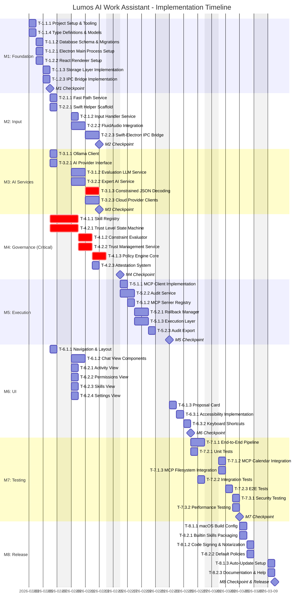

# Project Timeline v1.1

**Project:** Lumos - AI Work Assistant
**Start Date:** 2026-02-03
**Estimated End Date:** 2026-04-03
**Total Duration:** 8 weeks
**Estimated Tokens:** ~850K tokens
**CodeMaestro Version:** 1.1.0

---

## Executive Summary

| Metric                 | Value                     |
| ---------------------- | ------------------------- |
| Total Duration         | 8 weeks (40 working days) |
| Total Tasks            | 53 tasks                  |
| Parallel Groups        | 15 groups                 |
| Critical Path Duration | ~19 days (M4: Governance) |
| Total Tokens           | ~850K tokens              |
| Estimated Cost         | ~$46.40 USD               |

---

## Overview

This Gantt chart visualizes the implementation timeline for all 53 tasks across 8 milestones. The timeline excludes weekends and shows task dependencies and parallelization opportunities.

## Timeline Chart

## Timeline Summary

| Milestone                  | Duration | Start    | End      | Parallel Tasks          |
| -------------------------- | -------- | -------- | -------- | ----------------------- |
| M1: Foundation             | 4 days   | Week 1   | Week 1   | Yes (2 parallel tracks) |
| M2: Input & Classification | 5 days   | Week 2   | Week 2   | Yes (2 parallel tracks) |
| M3: AI Services            | 7 days   | Week 1-2 | Week 2-3 | Yes (2 parallel tracks) |
| M4: Governance             | 7 days   | Week 1-2 | Week 2-3 | Yes (2 parallel tracks) |
| M5: Execution & Audit      | 6 days   | Week 3   | Week 4   | Yes (2 parallel tracks) |
| M6: User Interface         | 9 days   | Week 2-4 | Week 5   | Mostly parallel         |
| M7: Integration & Testing  | 7 days   | Week 5   | Week 6   | Some parallel           |
| M8: Packaging & Release    | 4 days   | Week 7   | Week 7   | Yes (2 parallel tracks) |

## Critical Path

The critical path (marked in red on the Gantt chart) includes:

1. **M4: Governance Pipeline** - All tasks are critical
2. **T-3.1.3: Constrained JSON Decoding** - Highest technical risk

Any delays in these tasks will directly impact the overall timeline.

## Parallelization Strategy

The timeline maximizes parallelization:

**Week 1-2 (Foundation):**

- M1, M2, M3, and M4 start simultaneously after M1 foundation tasks
- M6 UI work can start early for non-integrated components

**Week 3-4 (Integration):**

- M5 requires M2, M3, M4 completion
- M6 can continue in parallel with M5

**Week 5-6 (Testing):**

- M7 requires M5 and M6 completion
- Multiple test types run in parallel

**Week 7-8 (Release):**

- M8 packaging tasks run in parallel tracks

## Assumptions

1. Single developer working full-time (8 hours/day)
2. Weekends excluded from timeline
3. No major blockers or technical discoveries requiring rework
4. Ollama and MCP servers are pre-installed and configured
5. FluidAudio integration follows documented patterns

## Risk Factors

| Risk                                 | Impact    | Mitigation                               |
| ------------------------------------ | --------- | ---------------------------------------- |
| Constrained JSON decoding complexity | +2-4 days | Allocated extra time (6h vs 4h estimate) |
| Swift-Electron bridge issues         | +2-3 days | Early spike in M2                        |
| Policy engine performance            | +2-3 days | Load testing in M7                       |
| MCP server compatibility             | +1-2 days | Validation in M7 integration tests       |

## Milestones & Checkpoints

- **M1 Checkpoint**: Feb 7 - Foundation complete, can start parallel work
- **M4 Checkpoint**: Feb 18 - Governance pipeline complete (critical milestone)
- **M5 Checkpoint**: Feb 25 - Execution layer ready, UI can integrate
- **M6 Checkpoint**: Feb 28 - UI complete, ready for full E2E testing
- **M7 Checkpoint**: Mar 11 - All tests passing, quality gates met
- **M8 Release**: Mar 18 - Production-ready release

---

## Resource Allocation

| Week   | Milestone | Focus                    | Parallel Tasks           | Model Mix           |
| ------ | --------- | ------------------------ | ------------------------ | ------------------- |
| Week 1 | M1        | Infrastructure setup     | PG-001, PG-002 (4 tasks) | Haiku x4, Sonnet x3 |
| Week 2 | M2-M4     | Core services (parallel) | PG-003 (6 tasks)         | Haiku x3, Sonnet x8 |
| Week 3 | M3-M4     | AI & Governance          | PG-004, PG-005 (4 tasks) | Sonnet x6, Opus x1  |
| Week 4 | M5        | Execution layer          | PG-006 (2 tasks)         | Haiku x2, Sonnet x4 |
| Week 5 | M6        | User interface           | PG-007 (4 tasks)         | Haiku x5, Sonnet x4 |
| Week 6 | M7        | Integration & testing    | PG-008, PG-009 (4 tasks) | Haiku x5, Sonnet x3 |
| Week 7 | M8        | Release preparation      | PG-010 (2 tasks)         | Haiku x6            |

---

## Progress Tracking

### Weekly Progress

| Week   | Planned Tasks                            | Completed | Tokens Used | On Track       |
| ------ | ---------------------------------------- | --------- | ----------- | -------------- |
| Week 1 | M1 (7 tasks)                             | -         | 0K          | ⏳ Not Started |
| Week 2 | M2 (5 tasks), M3 (3 tasks), M4 (2 tasks) | -         | 0K          | ⏳ Not Started |
| Week 3 | M3 (3 tasks), M4 (4 tasks)               | -         | 0K          | ⏳ Not Started |
| Week 4 | M5 (6 tasks)                             | -         | 0K          | ⏳ Not Started |
| Week 5 | M6 (9 tasks)                             | -         | 0K          | ⏳ Not Started |
| Week 6 | M7 (8 tasks)                             | -         | 0K          | ⏳ Not Started |
| Week 7 | M8 (6 tasks)                             | -         | 0K          | ⏳ Not Started |
| Week 8 | Buffer / Polish                          | -         | 0K          | ⏳ Not Started |

---

## Version

| Field               | Value      |
| ------------------- | ---------- |
| Timeline Version    | 1.1        |
| CodeMaestro Version | 1.1.0      |
| Last Updated        | 2026-01-29 |

**Note:** This timeline is auto-generated from task estimates. Actual duration may vary based on technical discoveries and implementation complexity. Regular checkpoint reviews are recommended.
