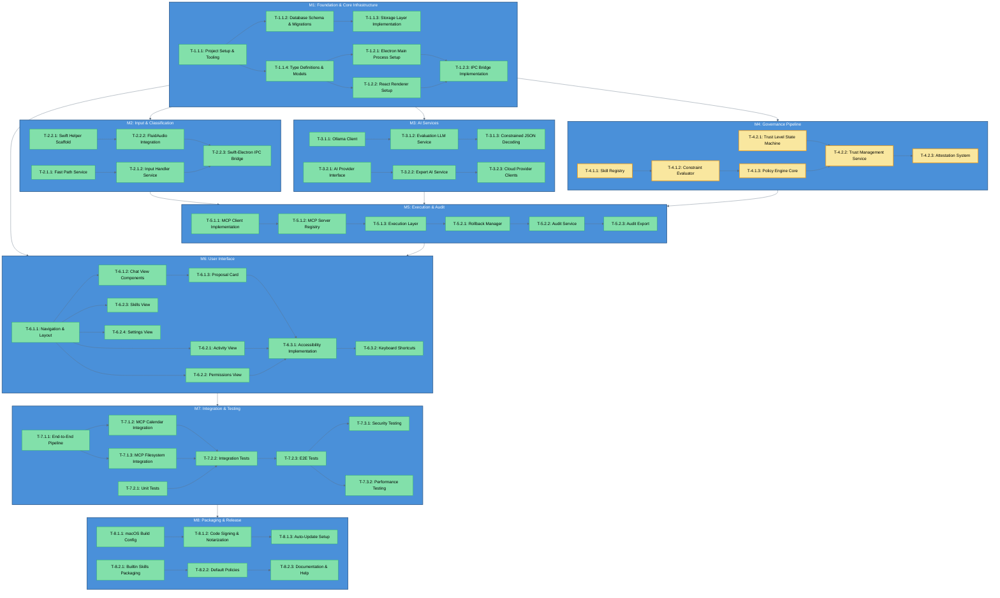

# Task Dependency Graph v1.1

**Project:** Lumos - AI Work Assistant
**Blueprint:** v1.1
**Date:** 2026-01-28
**Last Updated:** 2026-01-29
**CodeMaestro Version:** 1.1.0

---

## Executive Summary

**Project Objective:** Build a governed AI operating layer for desktop productivity with local-first architecture, deterministic policy evaluation, and complete audit trails.

**Key Metrics:**
| Metric | Value |
|--------|-------|
| Total Milestones | 8 |
| Total Modules | 23 |
| Total Tasks | 53 |
| Parallel Groups | 15 groups |
| Critical Path Tasks | 6 tasks (M4: Governance) |
| Estimated Total Hours | 208 hours (~5-6 weeks) |
| Estimated Total Tokens | ~850K tokens |
| Estimated Total Cost | ~$40-50 USD |

---

## Model Strategy & Cost Analysis

### Model Distribution

| Model | Task Count | Total Tokens | Estimated Cost | Use For |
|-------|------------|--------------|----------------|---------|
| **Haiku 4.5** | 22 tasks (41%) | ~280K tokens | ~$1.40 | Simple setup, config, CRUD, simple tests |
| **Sonnet 4.5** | 30 tasks (57%) | ~540K tokens | ~$40.50 | Business logic, integrations, most implementation |
| **Opus 4.5** | 1 task (2%) | ~30K tokens | ~$4.50 | Complex algorithms, constrained JSON decoding |
| **TOTAL** | **53 tasks** | **~850K tokens** | **~$46.40** | |

**Pricing (Jan 2026):**
- Haiku 4.5: $0.005 per 1K tokens
- Sonnet 4.5: $0.075 per 1K tokens
- Opus 4.5: $0.150 per 1K tokens

### Cost Optimization Recommendations

1. **Batch Haiku Tasks:** Group simple tasks (T-1.1.1, T-1.1.2, T-1.2.1, T-1.2.2, T-6.2.x) in single sessions → Save ~15%
2. **Sonnet Primary:** Use as default for balanced cost/quality (57% of tasks)
3. **Opus Sparingly:** Reserve for T-3.1.3 (Constrained JSON Decoding) only - highest technical risk

### Session Planning

| Session | Model | Tasks | Tokens | Focus Area |
|---------|-------|-------|--------|------------|
| Session 1 | Haiku | T-1.1.1, T-1.1.2, T-1.1.4 | ~50K | Foundation setup |
| Session 2 | Sonnet | T-1.1.3, T-1.2.3 | ~40K | Storage & IPC |
| Session 3-4 | Sonnet | M2 + M3 parallel | ~135K | Input & AI services |
| Session 5-6 | Sonnet | M4 Governance | ~180K | Critical path |
| Session 7-8 | Sonnet | M5 Execution | ~125K | MCP integration |
| Session 9-10 | Haiku/Sonnet | M6 UI | ~140K | User interface |
| Session 11-12 | Haiku | M7 Testing | ~90K | Quality assurance |
| Session 13 | Haiku | M8 Release | ~40K | Packaging & docs |

---

## Overview

This diagram shows the complete task dependency graph for Lumos implementation, organized by milestones. Critical path tasks (Milestone 4: Governance Pipeline) are highlighted.

---

## Technology Stack Reference

> **Important:** These are the verified library versions to use during implementation. Versions confirmed via Context7 MCP (January 2026).

| Category | Technology | Version | npm Package |
|----------|------------|---------|-------------|
| **Desktop Framework** | Electron | 39.x | `electron@^39.0.0` |
| **Build Tool** | Vite | 7.x | `vite@^7.3.1` |
| **Frontend** | React | 19.x | `react@^19.2.0` |
| **State Management** | Zustand | 5.x | `zustand@^5.0.10` |
| **Styling** | Tailwind CSS | 4.x | `tailwindcss@^4.1.18` |
| **UI Components** | shadcn/ui | 2.x | `shadcn@^2.3.0` (CLI) |
| **Language** | TypeScript | 5.x | `typescript@^5.9.3` |
| **Database** | better-sqlite3 | 12.x | `better-sqlite3@^12.6.2` |
| **DB Types** | @types/better-sqlite3 | Latest | `@types/better-sqlite3` |
| **Validation** | AJV | 8.x | `ajv@^8.19.0` |
| **MCP SDK** | MCP TypeScript SDK | 1.x | `@modelcontextprotocol/sdk@^1.25.2` |
| **MCP Dependency** | Zod | 3.x | `zod@^3.25.0` |
| **Unit Testing** | Vitest | 4.x | `vitest@^4.0.17` |
| **E2E Testing** | Playwright | 1.57.x | `@playwright/test@^1.57.0` |
| **Linting** | ESLint | 9.x | `eslint@^9.39.2` |
| **Formatting** | Prettier | 3.x | `prettier@^3.7.4` |
| **Package Manager** | pnpm | 9.x | N/A (global install) |
| **Node.js** | Node.js | 22.x LTS | N/A |
| **Build** | electron-builder | 26.x | `electron-builder@^26.5.0` |

---

## Task Outline with Metadata

### Difficulty Legend

| Level | Description | Typical Model |
|-------|-------------|---------------|
| **Easy** | Boilerplate, well-documented patterns, standard configurations | Haiku 4.5 |
| **Medium** | Moderate complexity, multiple components, requires context | Sonnet 4.5 |
| **Hard** | Complex logic, security-critical, extensive testing required | Sonnet 4.5 |
| **Complex** | Novel implementation, high technical risk, expert knowledge needed | Opus 4.5 |

### M1: Foundation & Core Infrastructure

| Task ID | Name | Difficulty | Model | Hours | Tokens | Test Types |
|---------|------|------------|-------|-------|--------|------------|
| T-1.1.1 | Project Setup & Tooling | Easy | Haiku | 4h | 15K | Smoke tests, build verification |
| T-1.1.2 | Database Schema & Migrations | Easy | Haiku | 4h | 15K | Schema validation, migration tests |
| T-1.1.3 | Storage Layer Implementation | Medium | Sonnet | 4h | 20K | Unit tests (CRUD), transaction tests |
| T-1.1.4 | Type Definitions & Models | Medium | Sonnet | 4h | 20K | Type compilation, guard tests |
| T-1.2.1 | Electron Main Process Setup | Easy | Haiku | 4h | 15K | Process startup, window tests |
| T-1.2.2 | React Renderer Setup | Easy | Haiku | 4h | 15K | Component render, routing tests |
| T-1.2.3 | IPC Bridge Implementation | Medium | Sonnet | 4h | 20K | IPC round-trip, error handling tests |

### M2: Input & Classification

| Task ID | Name | Difficulty | Model | Hours | Tokens | Test Types |
|---------|------|------------|-------|-------|--------|------------|
| T-2.1.1 | Fast Path Service | Easy | Haiku | 4h | 15K | Input detection, classification tests |
| T-2.1.2 | Input Handler Service | Easy | Haiku | 4h | 15K | Text/voice routing, validation tests |
| T-2.2.1 | Swift Helper Scaffold | Medium | Sonnet | 4h | 20K | Build verification, stub tests |
| T-2.2.2 | FluidAudio Integration | Medium | Sonnet | 6h | 25K | Audio capture, transcription tests |
| T-2.2.3 | Swift-Electron IPC Bridge | Medium | Sonnet | 6h | 25K | Cross-process communication tests |

### M3: AI Services

| Task ID | Name | Difficulty | Model | Hours | Tokens | Test Types |
|---------|------|------------|-------|-------|--------|------------|
| T-3.1.1 | Ollama Client | Easy | Haiku | 4h | 15K | Connection, health check tests |
| T-3.1.2 | Evaluation LLM Service | Medium | Sonnet | 6h | 25K | Prompt execution, response parsing tests |
| T-3.1.3 | Constrained JSON Decoding | Complex | Opus | 6h | 30K | Schema validation, edge case tests |
| T-3.2.1 | AI Provider Interface | Medium | Sonnet | 4h | 20K | Interface compliance tests |
| T-3.2.2 | Expert AI Service | Medium | Sonnet | 6h | 25K | Provider switching, fallback tests |
| T-3.2.3 | Cloud Provider Clients | Medium | Sonnet | 6h | 20K | API integration, auth tests |

### M4: Governance Pipeline (Critical Path)

| Task ID | Name | Difficulty | Model | Hours | Tokens | Test Types |
|---------|------|------------|-------|-------|--------|------------|
| T-4.1.1 | Skill Registry | Medium | Sonnet | 6h | 25K | CRUD, versioning, activation tests |
| T-4.1.2 | Constraint Evaluator | Hard | Sonnet | 6h | 30K | Rule evaluation, constraint logic tests |
| T-4.1.3 | Policy Engine Core | Hard | Sonnet | 8h | 35K | Policy evaluation, fail-safe, security tests |
| T-4.2.1 | Trust Level State Machine | Medium | Sonnet | 6h | 25K | State transitions, boundary tests |
| T-4.2.2 | Trust Management Service | Medium | Sonnet | 6h | 25K | Promotion/demotion, persistence tests |
| T-4.2.3 | Attestation System | Medium | Sonnet | 4h | 15K | Attestation flow, scheduling tests |

### M5: Execution & Audit

| Task ID | Name | Difficulty | Model | Hours | Tokens | Test Types |
|---------|------|------------|-------|-------|--------|------------|
| T-5.1.1 | MCP Client Implementation | Easy | Haiku | 4h | 15K | Connection, tool listing tests |
| T-5.1.2 | MCP Server Registry | Easy | Haiku | 4h | 15K | Registration, discovery tests |
| T-5.1.3 | Execution Layer | Medium | Sonnet | 6h | 25K | Tool execution, error handling tests |
| T-5.2.1 | Rollback Manager | Medium | Sonnet | 6h | 25K | Rollback execution, state recovery tests |
| T-5.2.2 | Audit Service | Medium | Sonnet | 6h | 25K | Log creation, immutability tests |
| T-5.2.3 | Audit Export | Medium | Sonnet | 4h | 15K | Export format, filtering tests |

### M6: User Interface

| Task ID | Name | Difficulty | Model | Hours | Tokens | Test Types |
|---------|------|------------|-------|-------|--------|------------|
| T-6.1.1 | Navigation & Layout | Easy | Haiku | 4h | 15K | Render, navigation tests |
| T-6.1.2 | Chat View Components | Medium | Sonnet | 6h | 20K | Message display, input tests |
| T-6.1.3 | Proposal Card | Medium | Sonnet | 4h | 20K | Render states, interaction tests |
| T-6.2.1 | Activity View | Easy | Haiku | 4h | 15K | List render, filtering tests |
| T-6.2.2 | Permissions View | Easy | Haiku | 4h | 15K | Trust display, update tests |
| T-6.2.3 | Skills View | Easy | Haiku | 4h | 15K | Skill list, activation tests |
| T-6.2.4 | Settings View | Medium | Sonnet | 4h | 15K | Form validation, persistence tests |
| T-6.3.1 | Accessibility Implementation | Medium | Sonnet | 4h | 15K | ARIA, keyboard navigation tests |
| T-6.3.2 | Keyboard Shortcuts | Medium | Sonnet | 4h | 15K | Shortcut registration, action tests |

### M7: Integration & Testing

| Task ID | Name | Difficulty | Model | Hours | Tokens | Test Types |
|---------|------|------------|-------|-------|--------|------------|
| T-7.1.1 | End-to-End Pipeline | Medium | Sonnet | 6h | 25K | Full flow integration tests |
| T-7.1.2 | MCP Calendar Integration | Easy | Haiku | 4h | 15K | Calendar operations tests |
| T-7.1.3 | MCP Filesystem Integration | Easy | Haiku | 4h | 15K | File operations tests |
| T-7.2.1 | Unit Tests | Easy | Haiku | 4h | 15K | Test infrastructure setup |
| T-7.2.2 | Integration Tests | Easy | Haiku | 4h | 15K | Cross-module tests |
| T-7.2.3 | E2E Tests | Easy | Haiku | 4h | 15K | User journey tests |
| T-7.3.1 | Security Testing | Medium | Sonnet | 4h | 15K | Penetration, vulnerability tests |
| T-7.3.2 | Performance Testing | Medium | Sonnet | 4h | 15K | Load, memory, timing tests |

### M8: Packaging & Release

| Task ID | Name | Difficulty | Model | Hours | Tokens | Test Types |
|---------|------|------------|-------|-------|--------|------------|
| T-8.1.1 | macOS Build Config | Easy | Haiku | 4h | 10K | Build verification tests |
| T-8.1.2 | Code Signing & Notarization | Medium | Sonnet | 4h | 15K | Signing verification tests |
| T-8.1.3 | Auto-Update Setup | Medium | Sonnet | 4h | 15K | Update flow tests |
| T-8.2.1 | Builtin Skills Packaging | Easy | Haiku | 4h | 10K | Skill loading tests |
| T-8.2.2 | Default Policies | Easy | Haiku | 4h | 10K | Policy validation tests |
| T-8.2.3 | Documentation & Help | Easy | Haiku | 4h | 10K | Documentation lint tests |

---

## Model Distribution Summary

| Model | Task Count | Percentage | Total Tokens | Use Case |
|-------|------------|------------|--------------|----------|
| **Haiku 4.5** | 22 | 41% | ~280K | Boilerplate, well-documented patterns |
| **Sonnet 4.5** | 30 | 57% | ~540K | Complex logic, moderate difficulty |
| **Opus 4.5** | 1 | 2% | ~30K | Novel/complex implementations |

---

## Task DAG



---

## Legend

- **Blue nodes**: Milestones (M1-M8)
- **Green nodes**: Standard tasks
- **Yellow nodes**: Critical path tasks (Governance Pipeline)
- **Arrows**: Dependencies (must complete before next task)

---

## Critical Path

The critical path runs through Milestone 4 (Governance Pipeline):
1. T-4.1.1: Skill Registry
2. T-4.1.2: Constraint Evaluator
3. T-4.1.3: Policy Engine Core (highest priority)
4. T-4.2.1: Trust Level State Machine
5. T-4.2.2: Trust Management Service

All execution (M5), UI (M6), and testing (M7) milestones depend on M4 completion.

---

## Parallel Groups

Tasks that can be executed concurrently to optimize development time:

### PG-001: M1 Foundation Setup
| Field | Value |
|-------|-------|
| Tasks | T-1.1.1 (Project Setup), T-1.1.4 (Type Definitions) |
| Rationale | Independent foundation tasks, no shared dependencies |
| Combined Tokens | ~35K |
| Est. Time Savings | 4 hours vs sequential |
| Recommended Model | Haiku for both |

### PG-002: M1 Electron Processes
| Field | Value |
|-------|-------|
| Tasks | T-1.2.1 (Electron Main), T-1.2.2 (React Renderer) |
| Rationale | Main and Renderer process setup are independent |
| Combined Tokens | ~30K |
| Est. Time Savings | 4 hours vs sequential |
| Recommended Model | Haiku for both |

### PG-003: M2/M3/M4 Milestone Start
| Field | Value |
|-------|-------|
| Tasks | T-2.1.1 (Fast Path), T-2.2.1 (Swift Scaffold), T-3.1.1 (Ollama Client), T-3.2.1 (AI Provider), T-4.1.1 (Skill Registry), T-4.2.1 (Trust State Machine) |
| Rationale | All depend only on M1, can start in parallel |
| Combined Tokens | ~140K |
| Est. Time Savings | 16 hours vs sequential |
| Recommended Model | Haiku for T-2.1.1, T-3.1.1, T-3.2.1; Sonnet for T-4.1.1, T-4.2.1 |

### PG-004: M3 AI Provider Tracks
| Field | Value |
|-------|-------|
| Tasks | T-3.1.2 (Evaluation LLM), T-3.2.2 (Expert AI) |
| Rationale | Local and cloud AI tracks are independent |
| Combined Tokens | ~50K |
| Est. Time Savings | 6 hours vs sequential |
| Recommended Model | Sonnet for both |

### PG-005: M4 Governance Tracks
| Field | Value |
|-------|-------|
| Tasks | T-4.1.2 (Constraint Evaluator), T-4.2.2 (Trust Management) |
| Rationale | After their respective foundations (T-4.1.1, T-4.2.1) |
| Combined Tokens | ~50K |
| Est. Time Savings | 6 hours vs sequential |
| Recommended Model | Sonnet for both |

### PG-006: M5 Parallel Tracks
| Field | Value |
|-------|-------|
| Tasks | T-5.1.1 (MCP Client), T-5.2.2 (Audit Service) |
| Rationale | Execution and audit are independent modules |
| Combined Tokens | ~40K |
| Est. Time Savings | 6 hours vs sequential |
| Recommended Model | Haiku for T-5.1.1, Sonnet for T-5.2.2 |

### PG-007: M6 Secondary Views
| Field | Value |
|-------|-------|
| Tasks | T-6.2.1 (Activity), T-6.2.2 (Permissions), T-6.2.3 (Skills), T-6.2.4 (Settings) |
| Rationale | All views depend only on Navigation (T-6.1.1) |
| Combined Tokens | ~60K |
| Est. Time Savings | 12 hours vs sequential |
| Recommended Model | Haiku for T-6.2.1, T-6.2.2, T-6.2.3; Sonnet for T-6.2.4 |

### PG-008: M7 MCP Integrations
| Field | Value |
|-------|-------|
| Tasks | T-7.1.2 (Calendar), T-7.1.3 (Filesystem) |
| Rationale | Independent MCP server integrations |
| Combined Tokens | ~30K |
| Est. Time Savings | 4 hours vs sequential |
| Recommended Model | Haiku for both |

### PG-009: M7 Test Types
| Field | Value |
|-------|-------|
| Tasks | T-7.3.1 (Security), T-7.3.2 (Performance) |
| Rationale | Different test suites, can run concurrently |
| Combined Tokens | ~30K |
| Est. Time Savings | 4 hours vs sequential |
| Recommended Model | Sonnet for both |

### PG-010: M8 Release Tracks
| Field | Value |
|-------|-------|
| Tasks | T-8.1.1 (Build Config), T-8.2.1 (Skills Packaging) |
| Rationale | Build and content packaging are independent |
| Combined Tokens | ~20K |
| Est. Time Savings | 4 hours vs sequential |
| Recommended Model | Haiku for both |

**Total Time Savings from Parallelization:** ~66 hours (31% reduction from sequential)

---

## Token Budget Allocation

### Budget by Milestone

| Milestone | Tasks | Tokens | % of Total | Buffer (15%) | Total |
|-----------|-------|--------|------------|--------------|-------|
| M1: Foundation | 7 | 130K | 15% | 20K | 150K |
| M2: Input & Classification | 5 | 100K | 12% | 15K | 115K |
| M3: AI Services | 6 | 140K | 16% | 21K | 161K |
| M4: Governance (Critical) | 6 | 160K | 19% | 24K | 184K |
| M5: Execution & Audit | 6 | 120K | 14% | 18K | 138K |
| M6: User Interface | 9 | 125K | 15% | 19K | 144K |
| M7: Integration & Testing | 8 | 95K | 11% | 14K | 109K |
| M8: Packaging & Release | 6 | 80K | 9% | 12K | 92K |
| **TOTAL** | **53** | **950K** | **100%** | **143K** | **1,093K** |

### Budget by Model

| Model | Tokens (Base) | Buffer (15%) | Total | Sessions Needed | Est. Cost |
|-------|---------------|--------------|-------|-----------------|-----------|
| Haiku | 280K | 42K | 322K | ~2 sessions | ~$1.61 |
| Sonnet | 540K | 81K | 621K | ~4 sessions | ~$46.58 |
| Opus | 30K | 5K | 35K | ~1 session | ~$5.25 |
| **TOTAL** | **850K** | **128K** | **978K** | **~7 sessions** | **~$53.44** |

### Session Budget Check

- **Per Session Limit (Sonnet 4.5):** 800K usable tokens (1M total - 200K reserve)
- **Total Project Tokens (with buffer):** 978K tokens
- **Sessions Required:** ~7 sessions minimum (1 Haiku-focused, 4 Sonnet, 1 Opus, 1 mixed)
- **Buffer Sessions:** 2 additional (for debugging, rework, clarifications)
- **Total Sessions:** ~9 sessions recommended

---

## Implementation Notes

### Key Patterns to Reuse
- **MCP Integration Pattern:** Apply T-5.1.1 pattern to T-7.1.2, T-7.1.3
- **Repository Pattern:** Reuse from T-1.1.3 across T-4.1.1, T-4.2.2, T-5.2.2
- **Service Layer Pattern:** Establish in M2, reuse in M3, M4, M5
- **React Component Pattern:** Establish in T-6.1.1, reuse across all views

### Potential Challenges
- **Challenge 1: Constrained JSON Decoding (T-3.1.3)** - High complexity, allocated Opus
  - Mitigation: Start with Ollama docs examples, test with simple schemas first
- **Challenge 2: Swift-Electron IPC Bridge (T-2.2.3)** - Cross-language integration
  - Mitigation: Use standard JSON-over-stdio pattern, test early
- **Challenge 3: Policy Engine Performance (T-4.1.3)** - Must meet <50ms requirement
  - Mitigation: Profile early, cache constraint compilation, optimize hot paths

### Anti-Hallucination Reminders
- **A7:** All APIs must be verified via Context7 before implementation
- **A7.5:** Copy verified examples from official docs (Electron, React, Ollama, MCP)
- All technology versions verified in Technology Stack document
- Use exact package versions from package.json template

---

## Development Workflow

### Recommended Task Order

1. **Foundation (M1):** Complete all M1 tasks first (1 week)
   - Start with PG-001 and PG-002 (parallel)
   - Then sequential tasks (T-1.1.2, T-1.1.3, T-1.2.3)
2. **Parallel Milestones (M2, M3, M4):** After M1 complete (2 weeks)
   - Use PG-003 to kickstart all three milestones
   - M4 is critical path, prioritize if resource constrained
3. **Execution (M5):** After M2, M3, M4 complete (1 week)
4. **UI (M6):** Partial start after M1, full work after M5 (1.5 weeks)
5. **Testing (M7):** After M6 complete (1 week)
6. **Release (M8):** After M7 passes quality gates (0.5 weeks)

### Git Strategy

| Phase | Branch | Merge To |
|-------|--------|----------|
| M1 | `feature/M1-foundation` | `develop` |
| M2-M4 (Parallel) | `feature/M2-input`, `feature/M3-ai`, `feature/M4-governance` | `develop` |
| M5 | `feature/M5-execution` | `develop` |
| M6 | `feature/M6-ui` | `develop` |
| M7 | `feature/M7-testing` | `develop` |
| M8 | `release/v1.0.0` | `main` |

### Quality Checkpoints

- [ ] After each module: Unit tests pass, lint clean, no TypeScript errors
- [ ] After each milestone: Integration tests pass, coverage >70%
- [ ] Before Phase 4: Full verification loop, all AC passing, security scan clean

---

## Progress Tracking

### Overall Progress

| Metric | Current | Target |
|--------|---------|--------|
| Tasks Completed | 0 / 53 | 53 |
| Hours Used | 0 / 208 | 208 |
| Tokens Used | 0 / 850K | 850K |
| Cost Spent | $0.00 / $46.40 | ~$46.40 |

### Milestone Progress

| Milestone | Tasks | Status | % Complete |
|-----------|-------|--------|------------|
| M1: Foundation | 0/7 | ⏳ Pending | 0% |
| M2: Input & Classification | 0/5 | ⏳ Pending | 0% |
| M3: AI Services | 0/6 | ⏳ Pending | 0% |
| M4: Governance (Critical) | 0/6 | ⏳ Pending | 0% |
| M5: Execution & Audit | 0/6 | ⏳ Pending | 0% |
| M6: User Interface | 0/9 | ⏳ Pending | 0% |
| M7: Integration & Testing | 0/8 | ⏳ Pending | 0% |
| M8: Packaging & Release | 0/6 | ⏳ Pending | 0% |

---

## Milestone Dependencies

```
M1 (Foundation)
├─→ M2 (Input)
├─→ M3 (AI Services)
├─→ M4 (Governance) ⚠️ CRITICAL
└─→ M6 (UI)

M2, M3, M4 → M5 (Execution)
M5 → M6 (UI completion)
M6 → M7 (Testing)
M7 → M8 (Release)
```

---

## Testing Strategy by Task Type

### Unit Test Requirements (All Tasks)

Each task must include unit tests covering:
- **Happy path**: Normal operation scenarios
- **Edge cases**: Boundary conditions, empty inputs, max values
- **Error handling**: Expected error scenarios, validation failures

### Integration Test Requirements

Tasks that interact with other modules must include:
- Cross-module communication tests
- Data flow validation tests
- State consistency tests

### E2E Test Requirements (UI Tasks)

UI tasks must include:
- User interaction tests (click, input, navigation)
- Visual regression tests (optional)
- Accessibility tests (ARIA, keyboard navigation)

---

## Implementation Notes for Models

### For Haiku 4.5 (Easy Tasks)

- Follow established patterns from similar projects
- Use provided code templates exactly
- Focus on correctness over optimization
- Keep implementations simple and readable

### For Sonnet 4.5 (Medium/Hard Tasks)

- Consider edge cases and error scenarios
- Implement comprehensive error handling
- Write clear inline documentation
- Include performance considerations

### For Opus 4.5 (Complex Tasks)

- Design before implementation
- Consider architectural implications
- Document design decisions
- Extensive testing coverage required

---

---

## Version

| Field | Value |
|-------|-------|
| Task DAG Version | 1.1 |
| CodeMaestro Version | 1.1.0 |
| Last Updated | 2026-01-29 |
| Author Role | Software Architect |

**Note:** This diagram is auto-generated from the task decomposition in Phase 2 (Planning). See [tasks/_index.md](tasks/_index.md) for detailed task information.
